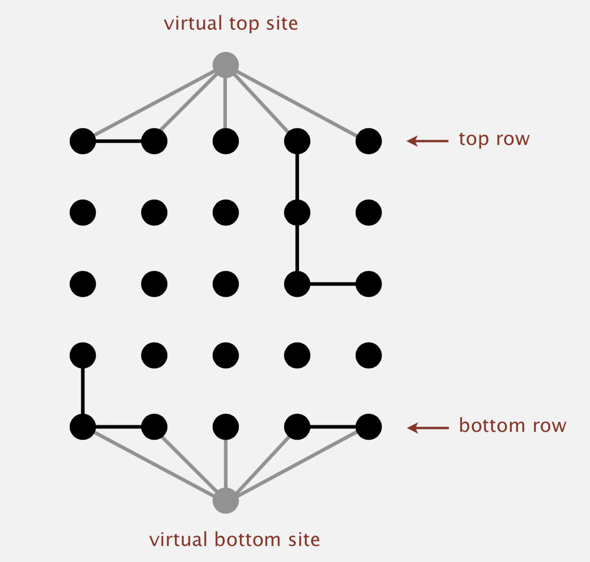
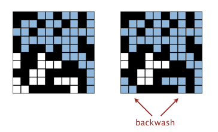

## Programming Assignment 1: Percolation

Write a program to estimate the value of the *percolation threshold* via Monte Carlo simulation.

**Assignment Description**: http://coursera.cs.princeton.edu/algs4/assignments/percolation.html

 ## Implementation Key Points

Here are two tricks in this implementation.

1. Using `virtualTopSite` and `virtualBottomSite`, thus the model percolates iff virtual top site is connected to virtual bottom site.
  

    
  

2. Using two `WeightedQuickUnionUF` objects. One is `ufWithTopAndBottom`, which contains both `virtualTopSite` and `virtualBottomSite`.  It is used to check `percolates()`. Another is `ufWithTop` which only contians `virtualTopSite`. This object is used to check `isFull()`. The reason of this design is to avoid **backwash** demonstrating as follows:

   

## How to Test

This program passed all test cases (excepting ungraded Checkstyle) in Coursera. And you can use provided ` PercolationVisualizer.java` and `InteractivePercolationVisualizer.java` to test it.

> ASSESSMENT SUMMARY
>
> Compilation:  PASSED
>
> API:          PASSED
>
> Spotbugs:     PASSED
>
> PMD:          PASSED
>
> Checkstyle:   FAILED (0 errors, 2 warnings)
>
> Correctness:  33/33 tests passed
>
> Memory:       8/8 tests passed
>
> Timing:       20/20 tests passed
>
> Aggregate score: 100.00%
>
> [Compilation: 5%, API: 5%, Spotbugs: 0%, PMD: 0%, Checkstyle: 0%, Correctness: 60%, Memory: 10%, Timing: 20%]

## Lincese

This program is released under the [MIT License](https://opensource.org/licenses/MIT).

